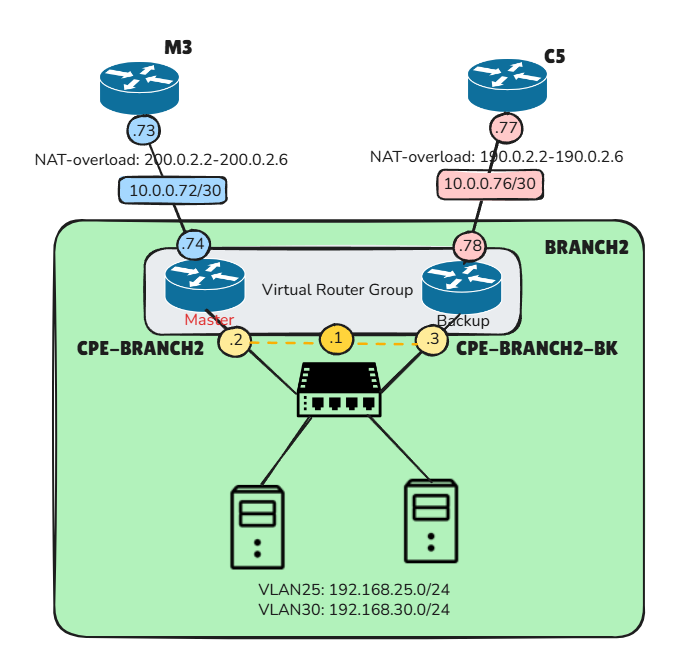

# 🎓 UNIVERSIDAD NACIONAL DE INGENIERÍA
## CURSO TLN03 — Automatización y Programabilidad de Redes
 
---
 
## 📋 Descripción
 
Repositorio base para el curso electivo **TLN03** de la Universidad Nacional de Ingeniería.  
Incluye topologías de red desplegadas con **Containerlab**, scripts de automatización en **Python** y una imagen **Docker** lista para ejecutar.
 
---
 
## 🗺️ Topología Base
 

 
---
 
## 🌐 Topología ISP — Branch2
 
Esta rama (`pc2-jhoveran`) extiende la topología base agregando la red **Branch2**,  
interconectada a través de **ISP-Movistar** e **ISP-Claro**.
 

 
---
 
## 🔒 Túneles DMVPN
 

 
---
 
## 📡 Direccionamiento Branch2
 

 
---
 
## 🐳 Automatización con Docker
 
Los scripts de configuración están empaquetados en una imagen Docker lista para usar.  
No necesitas instalar Python ni dependencias manualmente.
 
### Descargar la imagen
 
```bash
docker pull jhoveranc/script-automatizacion
```
 
### Ejecutar el deploy (configuración completa)
 
```bash
docker run --rm --network host jhoveranc/script-automatizacion
```
 
### Ejecutar la verificación
 
```bash
docker run --rm --network host jhoveranc/script-automatizacion python verify.py
```
 
> **Nota:** `--network host` es necesario para que el contenedor pueda alcanzar los nodos de Containerlab.
 
---
 
## 📁 Estructura de Scripts
 
| Archivo | Descripción |
|---|---|
| `deploy.py` | Script principal — configura todos los dispositivos vía SSH |
| `verify.py` | Script de verificación — comprueba el estado de la topología |
| `commands_hq.py` | Comandos para dispositivos HQ (hub DMVPN) |
| `commands_branch2.py` | Comandos para dispositivos Branch2 |
 
---
 
## 🛠️ Tecnologías
 
- 🐧 Linux
- 🐳 Docker
- 🔬 Containerlab
- 🖥️ Cisco IOL
- 🐍 Python (`paramiko`, `python-dotenv`)
- 📦 Ansible *(en desarrollo)*
---
 
## ⚙️ Configuraciones Base
 
Por desarrollar.
 
---
 
*Universidad Nacional de Ingeniería — Curso TLN03*
